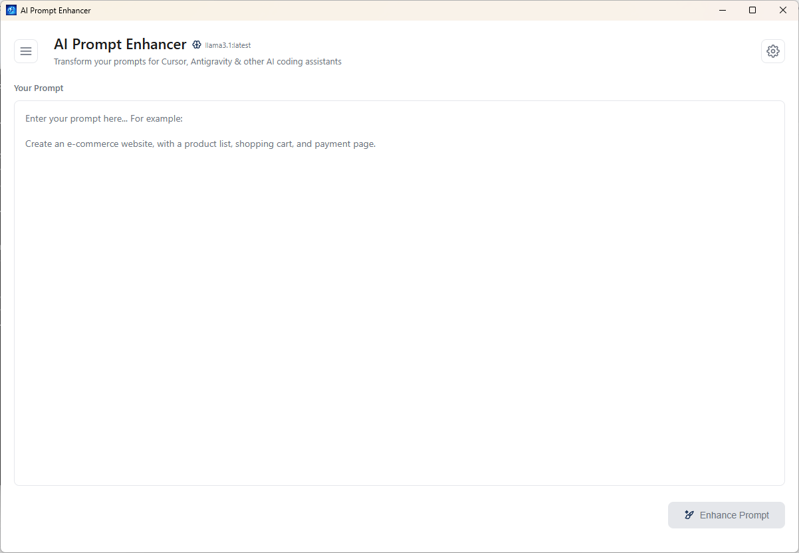

<p align="center">
  
</p>

<h1 align="center">AI Prompt Enhancer</h1>

<p align="center">
  <strong>A lightweight desktop application that transforms your prompts into optimized versions for AI coding assistants like Cursor, Antigravity, Windsurf, and similar tools.</strong>
</p>

<p align="center">
  Convert any prompt into a structured, actionable format with multilingual support, prompt history, and one-click copy functionality.
</p>

<p align="center">
  <a href="#features">Features</a> · <a href="#getting-started">Getting Started</a> · <a href="#building-from-source">Build</a> · <a href="#license">License</a>
</p>

<p align="center">
   
</p>

<p align="center">
  
</p>

---

## What is AI Prompt Enhancer?

AI Prompt Enhancer is a clean, minimal desktop application that takes your raw prompts and transforms them into well-structured, actionable formats optimized for AI coding assistants. Whether you're building a web app, debugging code, or designing a system architecture, this tool helps you communicate more effectively with AI tools.

The application uses the OpenRouter API (Devstral Free model) to enhance your prompts while keeping your API key stored securely on your local machine. All prompt history is also stored locally, ensuring your data stays private.

## Features

### Prompt Enhancement
- **Structured output** — converts any prompt into organized Objective, Tasks, and Requirements sections
- **Actionable format** — automatically structures tasks as numbered todo items
- **Context-aware** — adds relevant technical requirements based on your prompt

### Multilingual Support
- **Input any language** — accepts prompts in any language
- **8 output languages** — English, Türkçe, 中文, Français, 한국어, 日本語, हिन्दी, Shqip
- **Auto-detection** — understands context across languages

### User Experience
- **Prompt history** — view and manage your previous prompts with input/output details
- **One-click copy** — easily copy enhanced prompts to clipboard
- **Clean UI** — minimal, shadow-free design suitable for commercial use
- **Keyboard shortcuts** — press `Ctrl+Enter` to enhance prompts quickly

### Security
- **Local API key storage** — your OpenRouter API key is stored securely on your machine
- **No cloud dependencies** — all prompt history is stored locally
- **Open source** — audit the code yourself

## Getting Started

### Prerequisites

- [Node.js](https://nodejs.org/) (v18 or higher)
- [Rust](https://www.rust-lang.org/tools/install)
- [OpenRouter API Key](https://openrouter.ai/) (free tier available)

### Installation

1. Clone the repository:
```bash
git clone https://github.com/kodzamani/ai_prompt_enhancer.git
cd ai_prompt_enhancer
```

2. Install dependencies:
```bash
npm install
```

3. Run the application:
```bash
npm run dev
```

### Getting an OpenRouter API Key

1. Go to [OpenRouter](https://openrouter.ai/)
2. Create a free account
3. Navigate to API Keys section
4. Generate a new API key
5. Copy and paste it into the application (Settings)

## Usage

1. Click the Settings icon and enter your OpenRouter API key
2. Type or paste your prompt in any language
3. Click "Enhance Prompt" or press `Ctrl+Enter`
4. Copy the enhanced prompt and use it in your favorite AI coding assistant
5. Access your prompt history via the menu icon on the left

## Example

**Input:**
```
Create a blog site where users can register, write posts, and leave comments
```

**Output:**
```
## Objective
Build a full-featured blog platform with user authentication and content management capabilities.

## Tasks
1 - Set up project structure with appropriate framework (Next.js/React recommended)
2 - Implement user authentication system (registration, login, logout)
3 - Create database schema for users, posts, and comments
4 - Build user registration page with form validation
5 - Develop blog post creation interface with rich text editor
6 - Implement comment system with nested replies support
7 - Add user profile pages showing their posts and comments
8 - Create responsive UI for all pages

## Requirements
- Secure password hashing
- Form validation on both client and server
- Clean, modern UI design
```

## Building from Source

### Build for your platform:

```bash
# Windows
npm run build:win

# macOS
npm run build:mac

# Linux
npm run build:linux

# All platforms
npm run build
```

Output files will be in the `src-tauri/target/release/bundle/` folder.

### Project Structure

```
ai-prompt-enhancer/
├── src-tauri/              # Rust backend
│   ├── src/
│   │   ├── main.rs         # Tauri entry point
│   │   ├── lib.rs          # Library exports
│   │   └── commands.rs     # Tauri commands (API calls)
│   ├── Cargo.toml          # Rust dependencies
│   └── tauri.conf.json     # Tauri configuration
├── index.html              # Main HTML file
├── renderer.js              # Frontend logic
├── styles.css              # Application styles
├── package.json            # Node.js dependencies
└── copy-web.js             # Build script
```

## Tech Stack

- **Tauri 2.x** — Lightweight, secure cross-platform desktop app framework
- **Rust** — Backend logic and API communication
- **OpenRouter API** — AI model access (Devstral Free)
- **Vanilla JS** — No framework dependencies for the frontend

## Supported Output Languages

- English
- Türkçe
- 中文 (Chinese)
- Français
- 한국어 (Korean)
- 日本語 (Japanese)
- हिन्दी (Hindi)
- Shqip (Albanian)

## License

MIT License - feel free to use this project for personal or commercial purposes. See [LICENSE](LICENSE) for details.

## Contributing

Contributions are welcome! Please feel free to submit a Pull Request.
